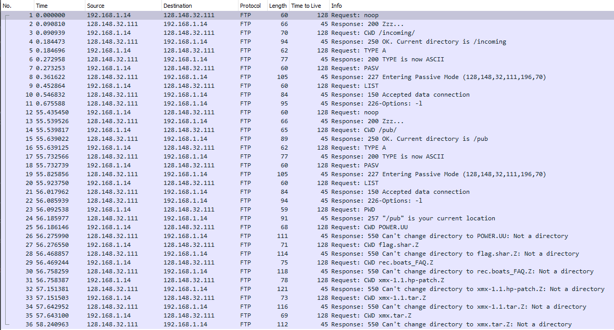

# ECE158B -- Project 1 -- Topic 1
## William Lynch A14588777 -- Dong On A15491340
---

### Overview

For our project we chose to do Topic 1, where we'll be capturing HTTP, FTP, VoIP and BitTorrent packets and analyzing their arrival time and payload size using the dpkt file parser library.  We analyzed our data by plotting the CDF and PDF of the inter-arrival time and payload sizes.

---

### Methodology

We began by capturing our packets for each of the protocols.  Firstly, we captured HTTP by accessing GNU.org, which actually as of writing this is now a secured HTTPS website.  To get FTP we accessed the FTP server at brown.edu.  For VoIP we recorded the UDP packets going back and forth while we talked to eachother across Zoom.  To get the BitTorrent packets we installed qBitTorrent on our Ubunutu VM because windows 10 blocks any torrent client from being used.  We then downloaded royalty free content.

After we captured our packets we needed to parse them out.  This proved to be difficult to do when it came to parsing by protocols that were not in the dpkt register of protocols.  This register did not include FTP, BitTorrent or HTTP.  For these captures, we filtered them out in wireshark and then exported only the displayed packets. So ultimately we had .pcap files that only included the protocols we wished to view.  This made it easier for us to parse the payload size and inter arrival time because we did not need to check if the packets were our desired protocol.  


|  |  |
|----|----|
|  |  |


VoIP was done differently however, we filterd in python by the UDP port of Zoom used during our call. 

```python
if (ip.p == dpkt.ip.IP_PROTO_UDP):
    #print(ip.p)
    # Grab data by port number 8801 = zoom
    if(pp.sport == 8801 or pp.dport == 8801):
        # Print out the timestamp in UTC
        time1 = datetime.datetime.utcfromtimestamp(timestamp)
        tt = time1.strftime('%H:%M:%S.%f')[:-4]
        # Finding interarrival time
        if (numPackets > 1):
            interArrival = (time1 - time2).total_seconds()
            timeArr.append(interArrival)
        # Payload size in bytes
        length = len(pp) - 8 #UDP header is 8 bytes
        lengthPackets.append(length)
        numPackets += 1
        time2 = datetime.datetime.utcfromtimestamp(timestamp)
```

After parsing out the data we saved them to CSV files so that we could use MatLab to generate the CDF and PDF of each sets of data.  

---

### How does the payload size distribution of different applications differ from each other?


---

### Explain your observations of the inter-arrival time distribution. 


---
